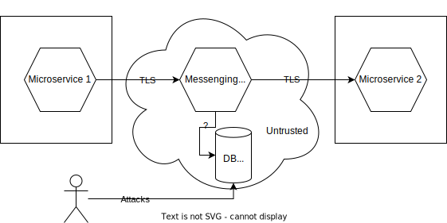
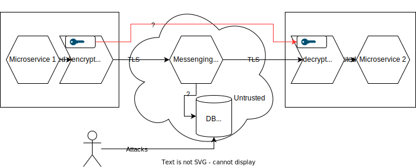
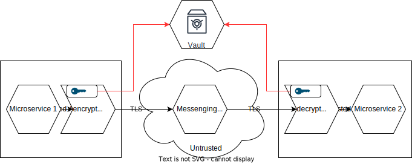
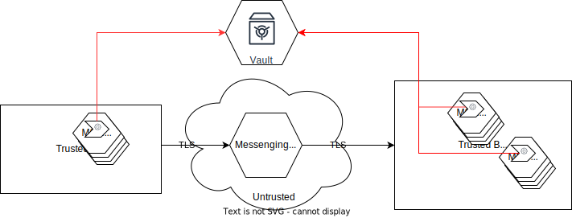

# micro-vault

micro-vault microservice dead simple key management service without any golden rings, just simple and secure

## Wofür gibt es diesen Server?

### Ausgangslage

Die Idee zu diesen Service entstand bei einem privaten Mikroservice Projekt. Dabei sollten bestimmte Daten zwischen Services über einen 3 Service (Message Broker) sicher ausgetauscht werden können. d.h. die Daten sollten für andere nicht beteiligte Komponenten nicht einsehbar sein. Es besteht aber zwischen den kommunizierenden Services keine direkte Verbindung. (Beide Service können sowohl zeitlich wie auch Räumlich getrennt sein.) 

Hier mal ein Beispiel einer Messaging Kommunikation zwischen 2 Servicen über eine 3 nicht vertraute Umgebung.

Schnell sieht man selbst wenn die eigentliche Kommunikation zwischen den einzelnen Servicen verschlüsselt stattfindet, kann ein Angreifer an die Daten gelangen. Denn wie die Datenablage erfolgt ist nicht immer ersichtlich und auf dem Messingsystem liegen zumindest zeitweise die Daten in unverschlüsselter Form vor. 




Man kann natürlich die Daten bereits auf der Sendeseite von MS1 verschlüsseln und dann auf der Empfangsseite von MS2 wieder entschlüsseln.



Aber wie kommt der Schlüssel von A nach B? 

Eine durchaus verbreitete Variante (ähnlich TLS) ist, den symmetrischen Schlüssel in der Payload zu schicken. Dieser wird dann mit dem öffentlichen Schlüssel des Zertifikates von Microservice 2 verschlüsselt. (Asymmetrische Verschlüsselung) Microservice 2 kann dann zunächst mit seinem privaten Schlüssel den symmetrischen Schlüssel dekodieren und dann die eigentliche Payload entschlüsseln.  

Soweit funktioniert das auch recht gut. Nachteil ist allerdings, Microservice 1 muss irgendwie an den öffentlichen Schlüssel von Microservice 2 kommen. Um nicht eine direkte Abhängigkeit von MS1 zu MS2 zuhaben, kann man das konfigurativ erledigen oder man legt die Schlüssel in einen zentralen Schlüsselspeicher. D.h. Es gibt einen dritten Vertrauten, der als Vermittler dient.



Der Client 1 muss nun aber weiterhin neue symmetrische Schlüssel generieren, MS2 muss einen asymmetrischen Schlüssel verwalten. In einer Multinodeumgebung ist die Verwaltung dabei eine Herausforderung. Nicht nur, dass auf der MS2 Seite nun die privaten Schlüssel an alle Nodes verteilt werden müssen. Auch beim Wiederruf müssen die neuen Zertifikate an alle Nodes und den Vault ausgerollt werden. Und auch die Schlüsselgenerierung auf der Client 1 Seite birgt Risiken. Besser wäre es wenn auch der private Schlüssel von MS 2 mit in dem Vault gelegt würde und nur bei Bedarf über eine sichere Verbindung übertragen wird. Der nächste logische Schritt ist es dann, auch die symmetrischen Schlüssel im Vault zu speichern und nur eine ID zur Identifizierung des Schlüssels an den Client 2 weiter zu geben. Vault kann dann durch zusätzliche Attribut checken, ob ein Zugriff auf den Schlüssel erlaubt ist. Somit entfällt auch die Notwendigkeit den symmetrischen Schlüssel mit dem öffentlichen Schlüssel von Client 2 zu verschlüsseln. Zusätzlich kann nun die Nachricht auch weiteren Clients zur Verfügung gestellt werden, den Zugriff auf die Schlüssel regelt dann Vault anhand von Zugriffsregeln. 




Da Vault nun alle Informationen zur Kommunikation hat, kann man der Ver/Entschlüsseln bzw. das Signieren und den Check dazu auch komplett auf Vault verlegen. Die Clients verwalten dann nur noch eine Verbindung. Nachteil ist dann natürlich, dass Vault neben der Schlüssel- und Clientverwaltung, nun auch die deutlich Resourcen bindende Arbeit des Ver/Entschlüsselns bzw. der Signierung übernehmen muss. In sofern ist die Nutzung von Serverside Encryption auch nur bei kleiner Payload zu empfehlen. 

### Was bietet nun MicroVault?

MicroVault bietet genau das, nicht mehr aber auch nicht weniger. MicroVault verwaltet Clients. Clients sind per Namen identifizierbar. Die Anmeldung erfolgt allerdings per AccessKey und Secret. Die eigentlichen Funktionen können dann über das bei der Anmeldung ausgestellte Token angesprochen werden. Ist dieses Token abgelaufen, kann per AccessKey/Secret ein neues Token ausgestellt werden. Clients können Gruppen zugeordnet werden. Nur innerhalb einer Gruppe können Keys (Signatur) und Schlüssel (Crypt) ausgetauscht werden.

Der Adminbereich ist per BasicAuth (Username/Passwort) bzw. per JWT und externem Identity-Management ansprechbar. Hier werden Gruppen und Clients verwaltet. 

Die Speicherung kann auf mehrere Arten erfolgen. Implementiert sind derzeit 3 Storagearten

1. In Memory: Hier werden alle relevanten Daten im Speicher von Vault gehalten. Für die Initialisierung beim Start kann ein Playbook verwendet werden. Somit können beim Start Clients und Gruppen erstellt werden. Ein Multinodebetrieb ist mit diesem Storage nicht möglich.
2. Filesystem: Mit diesem Storage werden die Daten in einem Filesystem gehalten. Dazu wird BadgerDB als Datenbank verwendet. Ein Multinodebetrieb ist mit diesem Storage auch nicht möglich.
3. MongoDB: Mit dem MongoDB Storage ist es möglich alle Daten verschlüsselt in eine MongoDB abzulegen. Dieser Storage kann auch im Multinode Betrieb verwendet werden.

Zur Anbindung an die Clients werden 2 REST Interfaces angeboten, einmal der Admin Bereich für das Management der Gruppen und Clients und ein weiteres REST Interface für den Client Bereich.   

## Speichermodelle

### Memory only

Im Memory-only Modell werden alle Daten ausschließlich im Speicher gehalten. Wird der Service neu gestartet, werden alle Einstellungen neu generiert. Es findet keine dauerhafte Persistierung statt. Direkt nach dem Start kann zur einmaligen Initialisierung ein Playbook in den Server geladen werden. Dort können Gruppen und Clients definiert werden.      

### Filesystem

Alle Daten werden auf dem Filesystem gespeichert. Ein Playbook kann auch hier zur Initialisierung verwendet werden. Das Filesystem hat allerdings Vorrang.

### MongoDB

Alle Daten werden verschlüsselt in einer MongoDB abgelegt. Die Datenbank wie auch die Collection und der Index müssen von Hand angelegt werden. Für eine Development Instanz gibt es im Doc Ordner die Datei  dev.md mit den entsprechenden Befehlen für die Mongo Shell.

### Multinodebetrieb

Im Multinodebetrieb werden alle Daten über ein eigenes Protokoll zu allen Nodes verteilt.  

## Kommunikationsablauf

### Usecase 1: Client A möchte an alle Clients der Gruppe B eine verschlüsselte Nachricht schicken.

- Client A meldet sich mit AccessKey und Secret an -> MV gibt ein JWToken zurück
- Client fordert ein Gruppen-Verschlüssellungszertifikat an -> MV generiert für die Gruppe B einen AES Schlüssel und eine ID. Beides wird als Antwort zu Client A gesendet.
- Client verschlüsselt die Nachricht, fügt der Nachricht die ID hinzu und versendet das ganze.
- Client C der Gruppe B ruft die Nachricht ab.
- Client C meldet sich an MV an, -> erhält ein JWT
- Client C fordert den Schlüssel mit der ID an, -> MV sucht in allen Gruppen von Client C nach dem Schlüssel zu ID, liefert diesen dann zurück
- Client C entschlüsselt die Nachricht. 

### Usecase 2: Client A möchte an Client B eine verschlüsselte Nachricht schicken

- Client A meldet sich mit AccessKey und Secret an -> MV gibt ein JWToken zurück
- Client fordert den Public Key von Client B an -> MV prüft ob A und B gemeinsame Gruppen haben. Public Key B wird als Antwort zu Client A gesendet.
- Client verschlüsselt die Nachricht und versendet das ganze.
- Client B ruft die Nachricht ab.
- Client B ruft seinen persönlichen Schlüssel ab.
- Client B entschlüsselt die Nachricht mit persönlichem Schlüssel. 

### Usecase 3: Client A möchte Daten einer Nachricht mit einer Signatur versehen

- Client A meldet sich mit AccessKey und Secret an -> MV gibt ein JWToken zurück
- Client A ruft seinen persönlichen Schlüssel ab.
- Client A bildet mit seinem privaten Schlüssel über die Daten eine Signatur
- Client A versendet die Nachricht, die Signatur und seinen Namen.
- Client B ruft die Nachricht, Signatur und den Namen ab.
- Client B fordert den öffentlichen Schlüssel von Client A an -> MV prüft die gemeinsamen Gruppen 
- Client B prüft die Signatur. 

### Serverside Encryption/Signing

ZUsätzlich zu der im Client implementierten Verschlüsselungs und Signierung implementiert MV auch einen Serverseitigen Ansatz. D.h. jeder Client kann Daten über den Server ver-/entschlüsseln bzw. signieren/validieren. Somit werden lokal keine Crypto Biblliotheken benötigt.

## Playbook

Das Playbook kann per Config (Einstellung playbook file) oder per Commandline (--playbook -b) übergeben werden. Eine Übergabe ist auch einmalig nach dem Start per REST POST möglich. Bei Ausführung mehrere Optionen wird folgende Reihenfolge verwendet. Bei gleichen Einstellungen erfolgt ein Merge. 

**Reihenfolge:** Config -> Commandline -> REST

playbook.json

```json
{
    "groups": [
        {
            "name": "group1",
            "label":
            {
                "en": "Group 1",
                "de": "Gruppe 1"
            }
        },
        {
            "name": "group3",
            "label":
            {
                "en": "Group 3",
                "de": "Gruppe 3"
            }
        },
        {
            "name": "group4",
            "label":
            {
                "en": "Group 4",
                "de": "Gruppe 4"
            }
        }
    ],
    "clients": [
        {
            "name": "tester1",
            "accesskey": "12345678",
            "secret": "yxcvb",
            "groups": [
                "group1",
                "group2",
                "group4"
            ]
        },
        {
            "name": "tester2",
            "accesskey": "87654321",
            "secret": "yxcvb",
            "groups": [
                "group2",
                "group4"
            ]
        },
        {
            "name": "tester3",
            "accesskey": "345678",
            "secret": "yxcvb",
            "groups": [
                "group3"
            ]
        }
    ]
}
   
```

Aus Sicherheitsgründen gibt keinen Weg, ein Playbook aus einem laufenden Server zu exportieren.  Allerdings gibt es einen Commandozeilen Parameter mit dem das Binary eine playbook.json aus einer Installation erzeugt. Dazu muss das Binary mit den gleichen Einstellungen wie der Service gestartet werden.  

# Admin Endpunkte

Im Adminbereich finden sich die Endpunkte zum anlegen eines Clients, Secreterneuerung, Gruppen-Administration. Wenn nicht anders vermerkt, sind die Endpunkte nur über einen angemeldeten User mit Adminrechten zu benutzen. Andere sind auch für angemeldete Clients benutzbar.

## Client CRUD

### Client erzeugen (Create)

Hiermit wird ein neuer Client erzeugt. 

In: Gruppen

Out: Access-Key, Secret

### Client Info (READ) *all 

Info über den Client 

Out: Accesskey, Secretablaufdatum, Gruppenzugehörigkeit

### Client Secreterneuerung (Update)

Hier wird ein für den CLient ein neues Secret angefordert. 

In: altes Secret

Out: neues Secret 

### Client löschen (Delete)

Löscht den Client vom MV Service

### Client Groups AD

Add, Delete fügt neue Gruppen zu einem Client hinzu, bzw. löscht mehere GRuppen eines Clients

## Gruppen CRUD

Crud Endpunkte für die Gruppen. 

### Gruppe anlegen (Create), Update(Update) und Löschen (Delete)

Verwaltung der Gruppen

### Gruppe lesen (Read) *all

die Gruppeninfos aller Gruppen sind für jeden angemeldeten Client lesbar.

## Playbook Post

Mit diesem Endpunkt kann ein Playbook nur einmal nach dem Start innerhalb einer in der Config einstellbaren Zeit hoch geladen werden. Dieses gilt dann als Basis für den weiteren Betrieb.  

# Client Endpunkte

## Client Login

POST: /api/v1/vault/login

Body: {}

Beim Clientlogin mit Accesskey und secret wird ein JWToken geniert, welches zur weiteren Identifizierung verwendet werden muss. 

